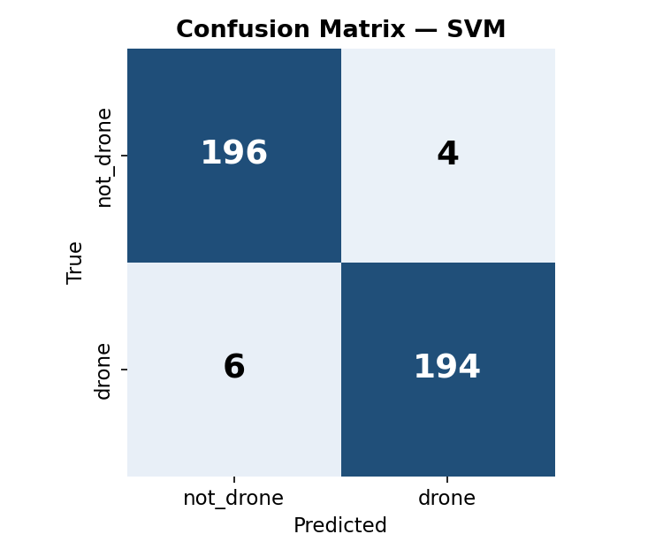
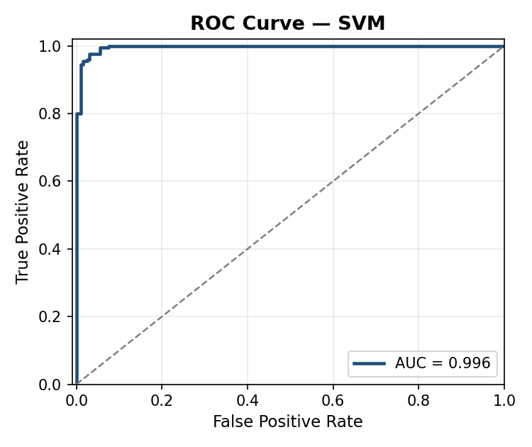

<div align="center">

# 🛩️ Drone Audio Detection

**Akustik imzadan İHA tespiti**
Log-Mel spektrogram üzerinde CNN + MFCC üzerinde SVM karşılaştırması


**Test seti sonuçları: SVM %97.5 doğruluk · CNN %96.5 doğruluk**

</div>

---

## Neden bu projeyi yaptım

Geçen dönem [`speech-gender-classifier`](https://github.com/mustafamerttaskin/speech-gender-classifier) projemi bitirdikten sonra sinyal işleme tarafına ilgim iyice arttı. STE, ZCR, otokorelasyonla F0 çıkarımı gibi yöntemleri konuşma sinyaline uygulamıştım; aynı araçları başka bir probleme uygulayınca ne olur diye merak ettim.

İnsansız hava araçlarının (İHA) tespiti bu sıralar hem sivil hem de savunma tarafında önemli bir problem. Görsel yöntemler (kamera + YOLO gibi) gece, sis ve engel arkasında zayıf kalıyor. Akustik tespit ise ucuz bir mikrofonla çalışabilen, bu senaryoları tamamlayan bir yöntem. Öğrenci projesi kapsamında sıfırdan yapılabilecek, aynı zamanda hem klasik sinyal işleme hem de derin öğrenme tarafını kapsayabilen tam bir problem olduğu için bunu seçtim.

Amacım "bir CNN çalıştırdım işte" demenin ötesinde şuydu: **aynı problem üzerinde klasik yöntem (MFCC + SVM) ile derin öğrenmeyi (Mel-spektrogram + CNN) karşılaştırıp aralarındaki farkı gerçekten ölçmek**. Bu proje ikisini de yapıp sonuçları karşılaştırıyor.

---

## Sonuçlar

Test seti üzerinde (400 örnek, %15'lik stratified split):

| Model | Accuracy | Precision | Recall | F1 | ROC-AUC |
|---|---|---|---|---|---|
| **SVM (MFCC + spektral öznitelikler)** | **0.9750** | 0.9798 | 0.9700 | 0.9749 | 0.9962 |
| **CNN (Log-Mel Spektrogram)** | **0.9650** | 0.9947 | 0.9350 | 0.9639 | 0.9933 |

Sonuçlar biraz ilginç çıktı: **SVM baseline'ı CNN'i çok az farkla geçti.** İlk başta ters gibi göründü çünkü genelde "deep learning kazanır" beklentisi vardır. Ama düşününce şunu farkettim:

- Veri seti çok büyük değil (~2664 örnek). CNN büyük veri istiyor.
- MFCC + spektral öznitelikler zaten sesi çok iyi özetleyen, elle tasarlanmış güçlü özniteliklerdir. Küçük veri setlerinde bu tür klasik yöntemler CNN'e karşı rekabetçi olabiliyor.
- CNN'in precision'ı (0.9947) SVM'inkinden yüksek — yani "drone" dediğinde neredeyse hep haklı. Ama recall'ü (0.9350) daha düşük — bazı drone'ları kaçırıyor. SVM ise daha dengeli.

Bu bulgu, CV'de "her problem için deep learning gerekmez, veri boyutuna ve problemin doğasına göre model seçilir" prensibini destekleyen güzel bir örnek oldu. Daha fazla veri (10K+ örnek) olsaydı CNN muhtemelen açık ara kazanırdı.

Sonuç grafikleri:

<div align="center">

<table>
<tr>
<td><b>SVM Confusion Matrix</b></td>
<td><b>CNN Confusion Matrix</b></td>
</tr>
<tr>
<td></td>
<td></td>
</tr>
<tr>
<td><b>SVM ROC Eğrisi</b></td>
<td><b>CNN Eğitim Eğrileri</b></td>
</tr>
<tr>
<td></td>
<td></td>
</tr>
</table>

</div>

---

## Sistem Mimarisi

<div align="center">
  
</div>

Boru hattı özetle şöyle: Ham ses → 22050 Hz mono + 2 sn sabit uzunluk → augmentasyon (yalnızca eğitimde) → iki dallı öznitelik çıkarımı → SVM veya CNN → Softmax olasılık → tahmin.

---

## Veri Seti

- **Ana kaynak:** [Sara Al-Emadi Drone Audio Dataset](https://github.com/saraalemadi/DroneAudioDataset)
- Kullandığım kısım: `Binary_Drone_Audio/yes_drone` ve `unknown` klasörleri
- Sınıflar arası dengesizlik vardı (drone: 1332, unknown: 10372). Modelin "her şeye not_drone" diyerek yüksek doğruluk hilesi yapmaması için `not_drone` sınıfını **rastgele 1332'ye indirdim** (undersampling). Böylece iki sınıf da dengeli oldu.
- Toplam: **2664 örnek** → %70 train / %15 val / %15 test (stratified split)

---

## Teknik Detaylar

### Öznitelik Çıkarımı

**SVM için (1B vektör, 264 boyut):**
- 40 katsayılı MFCC + delta + delta² (birinci ve ikinci türev)
- Spektral centroid, bandwidth, rolloff, contrast (7 bant)
- Zero-Crossing Rate ve RMS enerji
- Her özniteliğin frame düzeyinde ortalama ve standart sapması alınıp birleştiriliyor

Bu vektör `StandardScaler` ile ölçekleniyor, sonra RBF kernel'li SVM'e veriliyor.

**CNN için (2B görüntü):**
- 64 mel bantlı log-mel spektrogram (n_fft=2048, hop=512)
- Örnek düzeyinde z-score normalizasyonu
- CNN'e (1, 64, T) şeklinde girdi olarak veriliyor

### CNN Mimarisi

Model boyutu bilinçli olarak küçük tuttum (~590K parametre). Sebep:
- Küçük veri setinde büyük model overfit ediyor
- MacBook Air CPU'da bile makul sürede eğitilebilmeli (bende ~15 dakika sürdü)
- İleride Raspberry Pi gibi bir edge cihaza taşınabilmesi mümkün olsun

Mimari:
```
Conv3×3 → BN → ReLU → Conv3×3 → BN → ReLU → MaxPool 2×2   (×4 blok)
                              ↓
                  Global Average Pooling
                              ↓
              Dropout → FC(64) → ReLU → Dropout → FC(2)
```

Global Average Pooling seçimi önemli çünkü girdi zaman uzunluğunu esnek yapıyor — sabit uzunlukta girdi zorunluluğu ortadan kalkıyor.

### Augmentasyon

Eğitim sırasında rastgele uygulanan:
- **Zaman kaydırma** (%50 olasılıkla) — İHA sesinin pencere içindeki konumuna model bağımlı olmasın diye
- **Gaussian gürültü** (%50, SNR 10-25 dB arası) — Gerçek dünyada arka plan gürültüsünü simüle eder
- **Ton kaydırma** (%30, ±2 yarı ton) — Farklı İHA motorlarının farklı temel frekanslarını simüle eder

### Eğitim

- Optimizer: AdamW (lr=0.001, weight_decay=1e-4)
- Scheduler: ReduceLROnPlateau (val_loss durgunlaşırsa lr'yi yarıya böl)
- Early stopping: sabır=8 (val_loss 8 epoch iyileşmezse dur)
- Batch size: 32
- Benim eğitimimde 29. epoch'ta early stopping devreye girdi

---

## Kurulum ve Çalıştırma

Ben Python 3.11 kullandım. Homebrew ile kurdum (Mac):

```bash
brew install python@3.11
```

Sonra:

```bash
git clone https://github.com/mustafamerttaskin/drone-audio-detection.git
cd drone-audio-detection

python3.11 -m venv .venv
source .venv/bin/activate           # Windows: .venv\Scripts\activate
python -m pip install --upgrade pip
python -m pip install -r requirements.txt
```

Veri setini indirmek için:

```bash
# Kendi bilgisayarına klonla (yaklaşık 275 MB)
git clone https://github.com/saraalemadi/DroneAudioDataset.git

# Sonra ses dosyalarını data/raw/ altına kopyala (drone → drone/, unknown → not_drone/)
```

Detaylar için `scripts/download_dataset.py` içindeki talimatlara bak.

Eğitim ve tahmin:

```bash
# SVM eğitimi (~5-15 dk)
python -m src.train --model svm

# CNN eğitimi (~15-30 dk MacBook Air CPU'da)
python -m src.train --model cnn

# Tahmin
python -m src.inference --audio ornek.wav --model cnn

# Streamlit web demosu
streamlit run app/streamlit_app.py
```

---

## Streamlit Web Demosu

`app/streamlit_app.py` içinde. Ses dosyası yükleyince:
- Model tahminini gösterir (drone / not_drone)
- Sınıf olasılıklarını bar chart olarak çizer
- Yüklenen sesin log-mel spektrogramını görselleştirir

Bu, teknik olmayan birine projeyi anlatırken çok işe yaradı — soyut sayılar yerine görsel bir çıktı olması ilgi çekici oluyor.

---

## Projede Zorlandığım Yerler

Bu projede en çok üç yerde takıldım:

**1. Sınıf dengesizliği.** İlk denememde `not_drone` klasörü drone'dan 8 kat büyüktü. Model %90 doğruluk verdi ama karışıklık matrisine bakınca fark ettim ki her şeye "not_drone" diyor. Bu yüzden undersampling yapıp iki sınıfı eşitledim, o zaman gerçek performansı gördüm.

**2. Sabit uzunluk politikası.** Ses dosyaları farklı sürelerde geliyor. 2 saniyeye ayarladım ama kısa dosyalar için sıfır doldurma (padding), uzunlar için random crop uyguladım. Random crop'un aynı zamanda hafif bir data augmentation etkisi de yaptığını sonradan fark ettim — bunu README'ye net şekilde yazmak istedim.

**3. CNN vs SVM karşılaştırması.** İçgüdüsel olarak "CNN daha iyi olacak" beklerken SVM'in az farkla önde çıkması ilk başta beni şaşırttı. Ama sonra bunun küçük veri seti + iyi elde tasarlanmış öznitelikler kombinasyonunun beklenebilir bir sonucu olduğunu okuduğumda mantıklı geldi. Bu bulgu benim için projenin en öğretici kısmı oldu.

---

## Gelecek Planları

- SpecAugment (frekans/zaman maskeleme) ile CNN augmentasyonunu güçlendirmek
- Çok sınıflı sınıflandırma: helicopter / airplane / drone / background (ESC-50 birleştirilerek)
- Raspberry Pi 4 üzerinde canlı mikrofon akışı denemesi
- ONNX'e dönüştürüp inference süresi kıyaslaması

---

## Proje Yapısı

```
drone-audio-detection/
├── configs/
│   └── config.yaml              # Tüm hiperparametreler
├── src/
│   ├── audio_utils.py           # Ses yükleme + augmentasyon
│   ├── feature_extraction.py    # MFCC, mel-spektrogram
│   ├── dataset.py               # PyTorch Dataset + split
│   ├── models/
│   │   ├── cnn_model.py         # Kompakt CNN
│   │   └── svm_baseline.py      # RBF-SVM pipeline
│   ├── train.py                 # Eğitim + değerlendirme
│   └── inference.py             # Tek dosya tahmini
├── app/
│   └── streamlit_app.py         # Web demo
├── scripts/
│   ├── download_dataset.py      # Veri seti hazırlık
│   └── generate_synthetic_data.py  # Sentetik test verisi
├── tests/
│   └── test_features.py         # pytest testleri
├── reports/                     # Sonuç grafikleri ve metrikler
└── models/                      # Eğitim çıktıları
```

---

## Kaynaklar

- Al-Emadi, S., Al-Ali, A., Mohammad, A., & Al-Ali, A. (2019). *Audio-based drone detection and identification using deep learning*. IWCMC 2019.
- Piczak, K. J. (2015). *ESC: Dataset for Environmental Sound Classification*. ACM Multimedia.
- librosa dokümantasyonu: https://librosa.org/doc/latest/index.html
- PyTorch dokümantasyonu: https://pytorch.org/docs/stable/index.html

---

## Yazar

**Mustafa Mert Taşkın**
Bilgisayar Mühendisliği Öğrencisi — İstanbul Sağlık ve Teknoloji Üniversitesi

- GitHub: [@mustafamerttaskin](https://github.com/mustafamerttaskin)
- E-posta: merttaskin67@gmail.com

Bu proje, akustik sinyal işleme alanındaki [`speech-gender-classifier`](https://github.com/mustafamerttaskin/speech-gender-classifier) çalışmamın devamı niteliğinde.

---

## Lisans

MIT License — bkz. [LICENSE](LICENSE)
